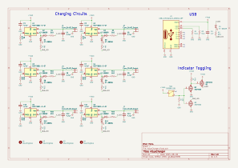
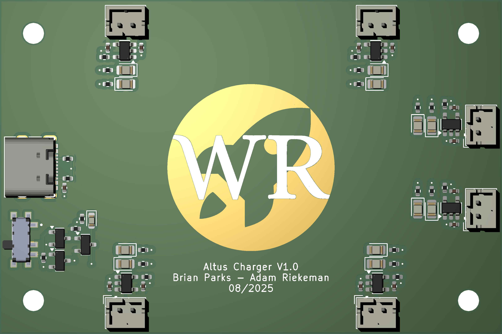
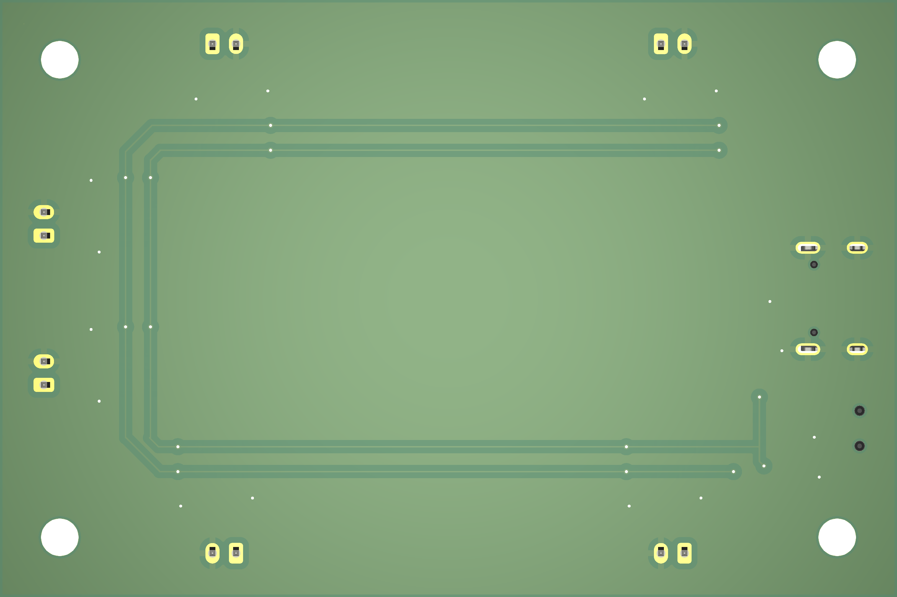

  <h1>Altus Charger</h1>
  6 channel output charger for AltusMetrum batteries. 
  
  ## Status
  Boards have arrived and passed testing great!
  

    <h3><em>3D Render:</em></h3>
    
  

  
  ## Hardware
  This project is designed to support charging of 6 Altus Metrum batteries over a 5V 2A USB-C connection using the same battery charging circuit as the Telemega. Therefore, the RProg resistor selection was set to 3.3k to charge each battery at ~300mA. For context, the Telemega integrated charger is configured to charge at ~342mA. This results in ~13% slower charging per battery. However, with the benefit of charging multiple batteries at once this quickly makes up the difference.
  This project also includes a switch to turn off the LED indicators for overnight charging. 
  
  ## Schematic
  <h3><em>Root Schematic:</em></h3>
  
The root level schematic shows the overall blocking of the hardware design.

   
      
  ## PCB Design
  

    <h3><em>3D Render:</em></h3>
    
    
  

  
  

    <h3><em>PCB Artwork:</em></h3>
    
     
  

